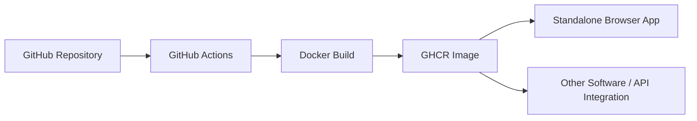

<h1 align="center">
  <br>
  Data Formulator — Docker Edition
</h1>

<p align="center">
  AI-powered data exploration & visualization, packaged for simple Docker deployment.
</p>

<p align="center">
  
  
  
</p>

---

## ✨ What is this?

A customized **Data Formulator** version focused on:

- 🐳 Running independently with Docker
- 🚀 Automatic Docker image publishing with GitHub Actions
- 🔌 Integration with other applications through HTTP APIs
- 🔐 User-provided AI API keys at runtime
- 💾 Persistent application data with Docker volumes

---

## 🚀 Quick Start

```bash
docker pull ghcr.io/mohamedoueslati-2/data-formulator:latest
```

```bash
docker run -d \
  --name data-formulator \
  -p 5567:5567 \
  -v data_formulator_home:/home/appuser/.data_formulator \
  ghcr.io/mohamedoueslati-2/data-formulator:latest
```

Open:

```text
http://localhost:5567
```

---

## 🔐 API Keys

No LLM API key is embedded in the Docker image.

The user starts the app and enters their own provider credentials directly in the interface.

```text
Start container
      ↓
Open Data Formulator
      ↓
Choose provider
      ↓
Enter API key
      ↓
Use the app
```

---

## 🧩 Architecture



Docker image:

```text
ghcr.io/mohamedoueslati-2/data-formulator:latest
```

---

## 🔌 Integration

Another application can communicate with Data Formulator over HTTP.

```text
Your App
React / Angular / FastAPI / ERP
        ↓
Data Formulator Container
        ↓
Data / AI / Visualization
```

Inside the same Docker network:

```text
http://data-formulator:5567
```

---

## 🔄 Development

```bash
git add .
git commit -m "Update Data Formulator"
git push origin main
```

Every push to `main` automatically rebuilds and publishes the Docker image.

---

## 📦 Docker Compose

```bash
docker compose up -d
```

Stop:

```bash
docker compose down
```

---

## 🔒 Security

Never commit:

```text
.env
API keys
tokens
passwords
private credentials
```

AI credentials should be entered by the user at runtime.

---

## 📚 Original Project

This project is based on **Microsoft Data Formulator**:

https://github.com/microsoft/data-formulator

Licensed under the **MIT License**.

Microsoft trademarks and logos must not be used in a way that implies Microsoft sponsorship or endorsement of this modified version.
